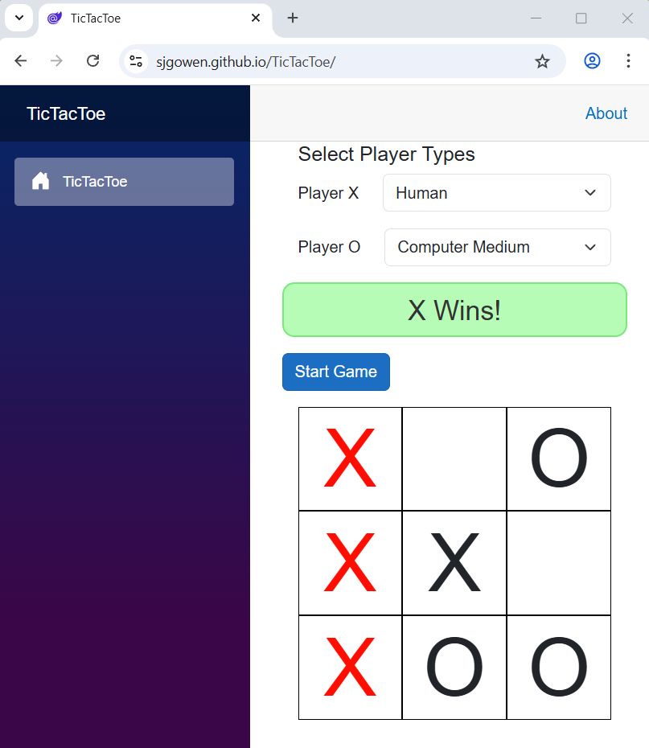

# 🎮 Tic Tac Toe - Blazor WebAssembly Game

A modern, interactive Tic Tac Toe game built with **Blazor WebAssembly** and **.NET 10**, featuring four distinct AI difficulty levels with strategic gameplay at each level.



## ✨ Features

- 🎯 **Four Difficulty Levels**: Choose from Easy, Medium, Hard, and Extreme
- 🤖 **Intelligent AI**: Each difficulty uses a different strategy algorithm
- ⚡ **Real-time Gameplay**: Smooth, responsive Blazor WebAssembly interface
- 🏗️ **Clean Architecture**: Strategy Pattern implementation for extensible AI
- 🧪 **Comprehensive Testing**: 35+ unit tests covering all strategies
- 📱 **Responsive Design**: Bootstrap-based UI for all screen sizes

## 🎮 Gameplay

### Game Rules
- Classic 3x3 Tic Tac Toe board
- Players take turns placing X or O
- First to get three in a row (horizontal, vertical, or diagonal) wins
- If the board fills with no winner, it's a draw

### Available Players
- **Human**: You control your moves
- **Computer Easy**: Random move selection - plays unpredictably
- **Computer Medium**: Strategic play with basic tactics
- **Computer Hard**: Advanced AI with position optimization
- **Computer Extreme**: Minimax algorithm - unbeatable perfect play

## 🧠 Difficulty Levels Explained

### Easy 🟢
**Strategy**: Random Move Selection

The AI makes completely random moves from available positions. Perfect for beginners or casual play.

**Characteristics:**
- No strategic thinking
- May ignore winning opportunities
- Fun and unpredictable
- Great for learning the game

```csharp
// EasyStrategy - Pure Randomness
Returns a random move from all available positions
Never considers winning or blocking moves
```

---

### Medium 🟡
**Strategy**: Basic Tactical Play

The AI prioritizes winning and blocking but otherwise plays randomly. Good for intermediate players.

**Decision Tree:**
1. ✅ Take a winning move if available
2. 🛡️ Block opponent's winning move if they can win
3. 🎲 Otherwise, choose randomly

**Characteristics:**
- Tactical awareness
- Defensive gameplay
- Still has weaknesses
- Good learning difficulty

```csharp
// MediumStrategy - Win/Block Priority
1. Find and take winning moves
2. Find and block opponent's winning moves
3. Fall back to random selection
```

---

### Hard 🔴
**Strategy**: Advanced Position Optimization

The AI uses sophisticated position evaluation with strategic priorities. Challenging for most players.

**Decision Tree:**
1. ✅ Take a winning move
2. 🛡️ Block opponent's winning move
3. 🎯 Play center (if empty)
4. 🚫 Block three-corner fork setups
5. 📐 Take corners
6. 📏 Take edges

**Characteristics:**
- Excellent defensive play
- Prevents opponent fork setups
- Values board control
- Rarely makes mistakes
- Competitive opponent

```csharp
// HardStrategy - Position Hierarchy
Prioritizes: Win > Block > Center > Anti-fork > Corners > Edges
Uses advanced tactics to control the board
```

---

### Extreme 💜
**Strategy**: Minimax with Full Game Tree Evaluation

The AI uses minimax algorithm to evaluate all possible future moves. Plays optimal, unbeatable Tic Tac Toe.

**Algorithm:**
- Recursively evaluates all possible game states
- Maximizes computer score
- Minimizes opponent score
- Finds the mathematically optimal move
- Guarantees at least a draw (cannot lose)

**Characteristics:**
- Perfect play - cannot be beaten
- Always finds the best move
- May be slow on first move (evaluates entire game tree)
- Excellent for testing/validation
- True AI challenge

```csharp
// ExtremeStrategy - Minimax Algorithm
Evaluates entire game tree recursively
Scores terminal states: Win=10, Draw=0, Loss=-10
Returns move with highest minimax score
Guarantees optimal play
```

---

## 🏗️ Architecture

### Strategy Pattern Implementation

This game uses the **Strategy Pattern** for flexible AI implementation, and all strategies share common helpers via `BoardUtilities`:

```
┌─────────────────────────────────────┐
│     ComputerPlayer                  │
│  (delegates to strategy)            │
└────────────┬────────────────────────┘
             │ uses
             ▼
    ┌────────────────────┐
    │ IComputerStrategy  │ (interface)
    └────────────────────┘
             ▲
    ┌────────┼────────┬──────────┐
    │        │        │          │
    ▼        ▼        ▼          ▼
┌────────┐┌──────────┐┌──────┐┌──────────┐
│ Easy   ││ Medium   ││ Hard ││ Extreme  │
└────────┘└──────────┘└──────┘└──────────┘
             ▲
             │
    ┌─────────────────────────────┐
    │      BoardUtilities         │
    │  (shared helpers:           │
    │   GetBlankMoves,            │
    │   IsWinningMove,            │
    │   GetRandomMove)            │
    └─────────────────────────────┘
```

**Benefits:**
- ✅ Each difficulty is a separate, testable unit
- ✅ Easy to add new strategies without modifying existing code
- ✅ Clear separation of concerns
- ✅ Extensible design pattern
- ✅ Shared helpers for DRY code

### Project Structure

```
TicTacToe/
├── Code/
│   ├── Strategies/          # AI Strategy implementations
│   │   ├── IComputerStrategy.cs
│   │   ├── ComputerStrategyBase.cs
│   │   ├── EasyStrategy.cs
│   │   ├── MediumStrategy.cs
│   │   ├── HardStrategy.cs
│   │   └── ExtremeStrategy.cs
│   ├── BoardUtilities.cs    # Shared board helpers (GetBlankMoves, IsWinningMove, GetRandomMove)
│   ├── ComputerPlayer.cs    # Strategy delegator
│   ├── GameBoard.cs         # Game logic & factory
│   ├── GameState.cs         # State management
│   ├── PlayerType.cs        # Enum for player types
│   └── ... (other game classes)
├── Pages/
│   └── TicTacToe.razor      # Main game UI
└── Program.cs              # Blazor WebAssembly setup

TicTacToe.Tests/
├── ComputerPlayerTests.cs           # Strategy integration
├── EasyStrategyTests.cs            # 4 tests
├── MediumStrategyTests.cs          # 6 tests
├── HardStrategyTests.cs            # 8 tests
└── ExtremeStrategyTests.cs         # 9 tests
```

## 🧪 Testing

**Comprehensive test coverage with 35+ unit tests:**

| Strategy | Tests | Coverage |
|----------|-------|----------|
| Easy | 4 | Random selection, no tactics |
| Medium | 6 | Win/block prioritization |
| Hard | 8 | Position optimization, fork blocking |
| Extreme | 9 | Minimax, optimal play |
| Integration | 8 | Strategy pattern, delegation |

**Run Tests:**
```bash
dotnet test TicTacToe.Tests
```

**Example test output:**
```
35 Tests (35 Passed, 0 Failed)
- EasyStrategyTests: ✅ All passing
- MediumStrategyTests: ✅ All passing
- HardStrategyTests: ✅ All passing
- ExtremeStrategyTests: ✅ All passing
- ComputerPlayerTests: ✅ All passing
```

## 🚀 Getting Started

### Prerequisites
- .NET 10 SDK
- Visual Studio 2026 or VS Code with C# extension

### Installation

1. **Clone the repository:**
```bash
git clone https://github.com/SJGowen/TicTacToe.git
cd TicTacToe
```

2. **Build the solution:**
```bash
dotnet build
```

3. **Run the tests:**
```bash
dotnet test
```

4. **Run the application:**
```bash
dotnet run --project TicTacToe
```

The application will be available at `https://localhost:5001`

## 🎯 How to Play

1. **Select Players**: Choose Human and Computer difficulty level
2. **Start Game**: Click "Start Game" button
3. **Make Moves**: Click on empty board squares to place your piece
4. **Wait for AI**: Computer automatically makes its move
5. **Win or Draw**: Game ends when someone wins or board is full
6. **Play Again**: Click "Start Game" to play again with same settings

## 🔧 Technology Stack

- **Framework**: ASP.NET Core Blazor WebAssembly
- **Language**: C# 13 (.NET 10)
- **UI Framework**: Bootstrap 5
- **Testing**: xUnit
- **Architecture**: Strategy Pattern + Shared Utilities
- **Logging**: Microsoft.Extensions.Logging

## 📚 Key Classes

### `BoardUtilities` (shared helpers)
```csharp
public static class BoardUtilities
{
    public static IEnumerable<Position> GetBlankMoves(GameBoard board);
    public static bool IsWinningMove(GameBoard board, Position move, PieceStyle style);
    public static Maybe<Position> GetRandomMove(ImmutableArray<Position> squares);
}
```

### `IComputerStrategy` Interface
```csharp
public interface IComputerStrategy
{
    Maybe<Position> GetMove(GameBoard board, PieceStyle computerStyle);
}
```

### `ComputerPlayer` Class
```csharp
public class ComputerPlayer : Player
{
    public ComputerPlayer(PieceStyle style, IComputerStrategy strategy, ILogger<ComputerPlayer>? logger = null);
    public override Maybe<Position> GetMove(GameBoard board)
    {
        return _strategy.GetMove(board, Style);
    }
}
```

### `GameBoard` Factory Pattern
```csharp
private Player CreatePlayer(PlayerType playerType, PieceStyle style)
{
    return playerType switch
    {
        PlayerType.Human => new HumanPlayer(style),
        PlayerType.ComputerEasy => new ComputerPlayer(style, new EasyStrategy()),
        PlayerType.ComputerMedium => new ComputerPlayer(style, new MediumStrategy()),
        PlayerType.ComputerHard => new ComputerPlayer(style, new HardStrategy()),
        PlayerType.ComputerExtreme => new ComputerPlayer(style, new ExtremeStrategy()),
        _ => throw new ArgumentException("Invalid player type")
    };
}
```

## 🤝 Contributing

Feel free to fork this repository and submit pull requests for improvements!

Possible enhancement ideas:
- 🌍 Multiplayer online mode
- 📊 Game statistics/leaderboard
- 🎨 Theme customization
- ⏱️ Timed moves
- 🎯 Larger board sizes (4x4, 5x5)

## 📝 License

This project is open source and available under the MIT License.

## 🙋 Support

For issues, questions, or suggestions, please open an issue on GitHub: https://github.com/SJGowen/TicTacToe/issues

## 📞 Contact

Created by: [@SJGowen](https://github.com/SJGowen)

---

**Enjoy playing! Can you beat the Extreme AI?** 🎮💜
